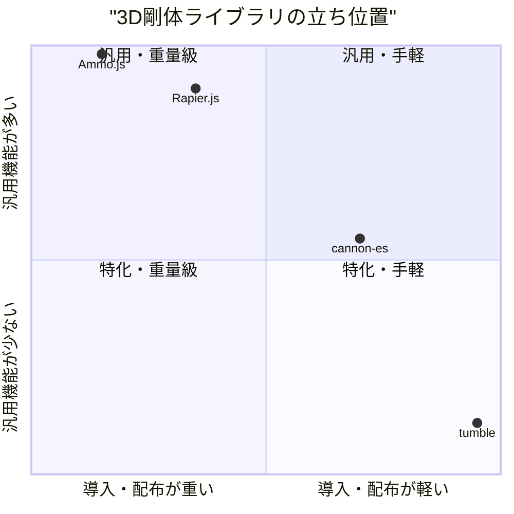
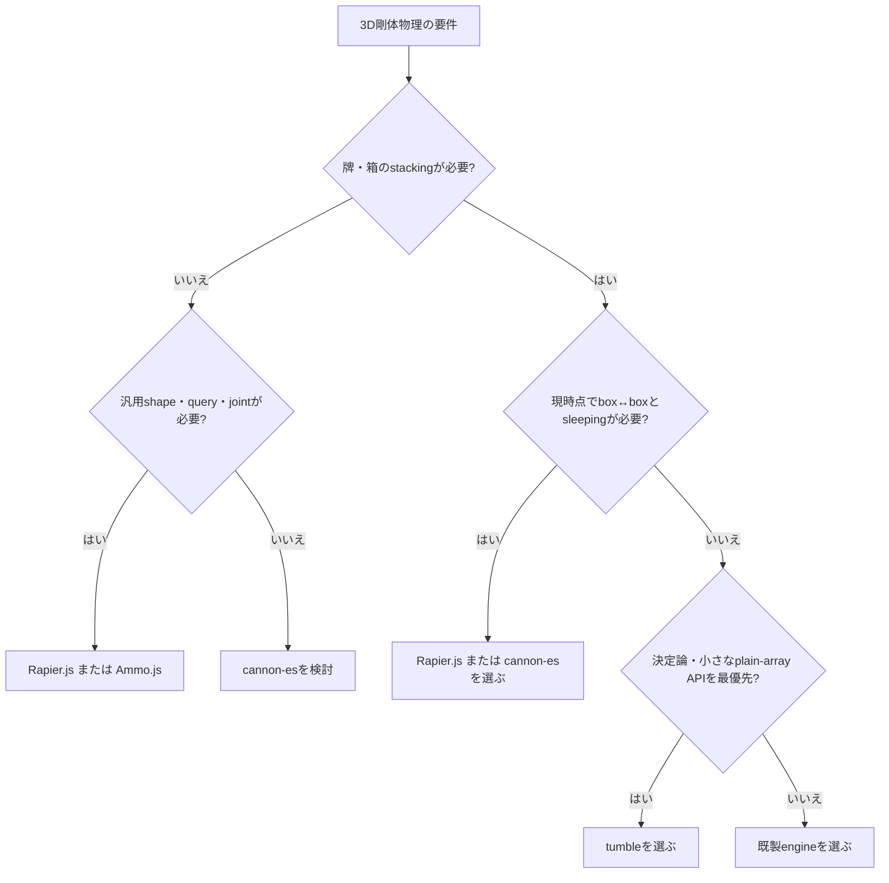

# 0. 要約

立ち位置: `tumble` は、一般用途の物理エンジンではなく、箱が転がり・倒れ・静止する挙動を決定論的に再生する小型3Dライブラリである。

最大の弱点: 現状は M1 で、地面との接触しか実装されておらず、麻雀牌の壁に必要な box↔box・摩擦・sleeping がまだない。

次の一手: M2 の SAT + manifold + 摩擦を最優先で完成させ、その挙動を「同じseedから同じ軌跡」として検証できるAPI・テストにする。

# 1. このrepoは何か

一言でいえば、レンダラを持たない、箱中心の3D剛体物理ライブラリである。`World` と `Body` の2つを公開し、入力・出力は `[x,y,z]` と `[x,y,z,w]` のplain arrayである。READMEと実装を照合すると、現時点の実装範囲は `Body`（box）、gravity、ground plane、8 cornerの地面接触、box inertia、XPBD position correction、dampingであり、設計書に書かれたsphereやbox↔boxは未実装である。

提供価値は、ブラウザの描画や大規模汎用機能を持ち込まず、牌・サイコロなど「落として、回って、面で止まる」演出を、Nodeでも再現可能な状態計算として扱えることにある。実利用では、上流にseeded game logic、下流にthree.js等のrendererが置かれるが、比較単位はrenderer込みの製品ではなく、同じ3D剛体シミュレーションを提供するライブラリとした。

想定利用者は、麻雀ゲームやサイコロ演出の実装者、または決定論的なheadless physics testを必要とするJavaScript開発者である。現時点の客観指標は、HEAD `eb1acb1`、`index.js` 5,415 bytes、`test.mjs` 実行時 `7 passed`、runtime依存0、公開クラス2（`World`、`Body`）である（参照日: 2026-07-31）。

READMEの「M1 done」と `DESIGN.md` のM2〜M4 plannedを、実装コードの公開APIと照合した。したがって、将来計画を現行機能として比較していない。

# 1.5 調査の型

`target_type: library`。利用者はプログラマで、価値は生成物の見た目ではなく、APIの小ささ、接触・慣性の実装、再現性、導入負担にある。比較軸は、箱・地面・箱同士の接触、摩擦、sleeping/broadphase、決定論、headless性、APIの入力負担、依存と配布形態とした。

# 2. 比較対象と選定理由

| 製品 | 何ができるか | 採用状況（参照日: 2026-07-31） | ライセンス | うちとの決定的な違い | なぜ選んだか |
|---|---|---|---|---|---|
| Rapier.js | 2D/3D、剛体、各種collider、joint、query、CCD、sleeping等。JavaScript bindingsは旧repoから本体repoの`typescript`へ移管 | ★695。旧`rapier.js` repoは2026-07-12にアーカイブ。0.19.3は2025-11-05 | Apache-2.0 | WASM/Rust由来で大規模・高機能。決定論版もあるが、初期化と配布物が重い | 現代のJS 3D physicsで、決定論・性能・機能の比較軸を同時に持つ代表例 |
| cannon-es | 純TypeScript/JavaScript系の3D剛体、shape、contact、friction、sleeping、trigger等 | ★2.0k。v0.20.0の最新releaseは2022-08-12 | MIT | `tumble`より汎用で、APIと実装規模が大きい。一方、同じくWeb向け軽量3D engine | 「小さく導入しやすい純JS系」の最も近い先行例 |
| Ammo.js | Bullet 2.82系をEmscriptenでJavaScript化。剛体だけでなくsoft bodyやvehicle等も扱う | ★4.5k。GitHub上の公開repoは436 commits。最終更新日は本調査で取得できず | zlib | C++移植の大きなAPIと生成コード。Bulletの機能を得る代わりに、plainな小型APIではない | 汎用3D物理の機能上限と、導入・デバッグ負担の対極を確認するため |

この地図は、機能の多い汎用エンジンと、軽量な純JSエンジンの間に、用途特化の極小ライブラリを置くものだ。star数だけでは`Tumble`の価値は測れないが、採用判断では「既製品で十分な範囲」と「決定論・APIの単純さを守るために自作する範囲」の境界が重要になる。RapierのJS bindingsが移管・旧repoアーカイブになった点は、機能差だけでなく、採用時に追う上流を確認すべきことを示す。

# 3. ポジショニング

軸は、公開README・package構成・実装範囲から確認できる導入負担と機能範囲を表す。位置は相対的な整理であり、厳密なベンチマーク値ではない。

# 4. 機能比較

| 機能 | 重み | tumble | Rapier.js | cannon-es | Ammo.js |
|---|---:|---:|---:|---:|---:|
| 3D rigid body | ◎必須 | ○ | ○ | ○ | ○ |
| box collider / anisotropic inertia | ◎必須 | ○ / ○ | ○ / ○ | ○ / ○ | ○ / ○ |
| ground plane | ◎必須 | ○ | ○ | ○ | ○ |
| box↔box contact / stable stacking | ◎必須 | ×（M2 planned） | ○ | ○ | ○ |
| Coulomb friction | ◎必須（牌の積み上げ） | ×（M2 planned） | ○ | ○ | ○ |
| sphere・複数shape | ○効く | ×（設計のみ） | ○ | ○ | ○ |
| broadphase・sleeping | ◎必須（136牌想定） | ×（M3 planned） | ○ | ○ | ○ |
| fixed-step / headless利用 | ◎必須 | ○ | ○ | ○ | △（WASM初期化を含む） |
| 決定論を製品要件として扱える | ◎必須 | ○（bit-identical test） | ○（deterministic buildあり） | △（固定stepは可能だが保証は確認できず） | △（保証は確認できず） |
| renderer / DOMへの依存なし | ○効く | ○ | ○ | ○ | ○ |
| 最小のplain-array API | ○効く | ○ | × | △ | × |

凡例: ○=ある / △=部分的・要設定 / ×=無い。重み: ◎=この立ち位置で必須 / ○=効く / △=あれば良い。

痛い×は、box↔box・摩擦・sleepingである。これは単なる機能数の不足ではなく、設計書にある麻雀牌の壁を成立させるための連鎖した必須条件で、M1の「一個の牌が面で止まる」成功から先に進めない。逆に、renderer非依存・headless・MITは競合にも多く、○であるだけでは差別化にならない。`tumble`が勝てるのは機能の広さではなく、必要な機能だけを小さく、同じ入力から同じ状態へ写像できることだ。

# 4.5 コード・実装の比較

| 観点 | tumble | Rapier.js | cannon-es | Ammo.js | 出典 |
|---|---:|---:|---:|---:|---|
| 公開クラス/主要API | 2 classes、主要操作4個 | 大規模な生成JS binding。総数は本調査で未算出 | TypeScriptの多数のclass。総数は未算出 | Bullet APIの多数の`bt*` binding。総数は未算出 | 各repoの公開source/tree、tumble `index.js` |
| runtime依存 | 0 | WASM/JS配布物 | package.json上0 | Emscripten生成物 | package.json / README |
| テスト | 7 passed（Node実行） | testbed・上流Rust由来のテスト構成。JSのpass数は未算出 | `test/` と Jest設定あり。pass数は未算出 | `tests/` とexamplesあり。pass数は未算出 | 各repoのtest構成、実行ログ |
| 配布サイズ | `index.js` 5,415 bytes | compat版等の複数配布形態。サイズは未算出 | packageは`dist/`を配布。サイズは未算出 | 生成JS/WASM。サイズは未算出 | package.json / README |
| ライセンス | MIT | Apache-2.0 | MIT | zlib | LICENSE / package.json |

比較対象のコードは、Rapierのbinding・cannon-esの`src`/`test`/`package.json`・Matter系の構成確認を入口に、今回の3D比較に直接採用したRapier/cannon-es/Ammo.jsの公開repo構成とREADME/API例まで読んだ。自repoは実行して数えたが、比較対象のAPI総数・test pass数・配布サイズは、同じ版をローカル取得して再実行できなかったため推測で埋めていない。この表から明確なのは、`tumble`の数値上の軽さは確認できる一方、汎用エンジン側の成熟度を機能数だけで否定する材料はないことだ。

# 5. 採用状況

比較対象3つと自repoのstar数を同じ条件で取得できなかったため、starの棒グラフは描かない。比較対象のGitHub表示値は上表に参照日付きで記録した。

# 5.5 調査者の見立て

本当の勝負所は、物理精度一般ではなく「牌・サイコロの姿勢が面で止まり、その結果がseedで再現できる」ことだと思う。RapierやAmmoに機能で勝つ必要はなく、cannon-esよりも入力・出力・検証の境界が明快であることが選択理由になる。

数字に出ていない懸念は、M2以降の接触solverが、今の小さなコードの読みやすさを保ったまま安定性を出せるかである。136個程度の牌で、積み上げの沈み込み・微振動・計算時間がどうなるかは、現時点では分からない。

私なら、まずM2を完成させて「麻雀牌の壁」を最小fixtureとして公開し、汎用shapeの追加は後回しにする。ライブラリの説明も「3D physics engine」より「deterministic tumbling/stacking for boxes」に寄せる。

この見立てが外れる条件は、M2/M3の実装が想定以上に不安定で、既製のRapierをseed付きwrapperとして使う方が同じ要件を短時間・高品質で満たせる場合だ。その場合、`tumble`の独自価値はAPIの小ささだけになり、継続自作の根拠は弱くなる。

# 6. 提案（優先順）

| 順 | 提案 | 分類 | 根拠 | 最小の一手 | 効きそうな指標 |
|---:|---|---|---|---|---|
| 1 | box↔box SAT + contact manifold + 摩擦をM2として完成 | 伸ばす | 4節の◎が現状×。麻雀牌の壁の前提 | 2箱の積み重ね、斜め着地、滑り停止のfixtureを追加 | 貫通深さ、積み上げ崩壊率、seed間の一致 |
| 2 | deterministic contractをAPIとテストで明文化 | 伸ばす | 現状は7テストでbit-identicalを確認済み。競合にも保証範囲の差がある | `World.step`の固定条件、NaN/Inf、実行環境差のテスト方針をREADMEに固定 | 同一seedのhash一致、Node版本間の差分、再現bug件数 |
| 3 | M3 broadphase + sleepingを136牌fixtureで測る | 埋める | 4節の◎が現状×。設計書にもM3として明記 | 136個の2段牌を生成し、step時間とsleep数を計測 | 95p step時間、active body数、静止までの時間 |
| 4 | `tumble`固有の最小APIとmahjong向けサンプルを整える | 伸ばす | 汎用engineとの差はplain-array・headless・用途特化 | CDN例、牌のdrop/stack fixture、renderer adapter非同梱の説明を追加 | Hello World行数、導入時の依存数、サンプル完走率 |
| 5 | 汎用shape・vehicle・joint・rendererを先に増やさない | やらない | Rapier/Ammoとの機能競争になり、差別化を薄める | DESIGNのM4までを優先し、新shapeは実ユーザー要件が出るまで保留 | API面積、配布サイズ、M2/M3完了までの期間 |

提案の順番は、まず「牌が互いに積める」、次に「同じ結果を保証できる」、最後に「136牌で速く止まる」である。ここを満たさない状態でshapeを増やしても、比較対象との差は埋まらず、実利用の価値も増えにくい。

# 7. 選択の分岐

現行の`tumble`は、単体の箱の転倒・着地と、その再現性を重視する段階に向く。今すぐ複数物体の安定したstackingが必要なら、M2/M3完成までは既製品を選ぶべきである。

# 8. 出典

| URL | 参照日 | 何の根拠に使ったか |
|---|---|---|
| `https://github.com/opaopa6969/tumble/blob/eb1acb1/README.md` | 2026-07-31 | repoの目的、API、M1 status、MIT、CDN例 |
| `https://github.com/opaopa6969/tumble/blob/eb1acb1/index.js` | 2026-07-31 | 実装範囲、公開class、XPBD地面接触、box inertia |
| `https://github.com/opaopa6969/tumble/blob/eb1acb1/test.mjs` | 2026-07-31 | Node実行、7 passed、bit-identical test |
| `https://github.com/opaopa6969/tumble/blob/eb1acb1/DESIGN.md` | 2026-07-31 | M2/M3/M4 planned、想定mahjong利用 |
| `https://github.com/dimforge/rapier.js` | 2026-07-31 | star 695、Apache-2.0、アーカイブと本体repoへの移管 |
| `https://github.com/dimforge/rapier.js/blob/master/CHANGELOG.md` | 2026-07-31 | 0.19.3 (2025-11-05)、deterministic build、機能追加の履歴 |
| `https://github.com/pmndrs/cannon-es` | 2026-07-31 | star 2.0k、MIT、3D engine、sleeping/trigger等の公開説明、v0.20.0 |
| `https://raw.githubusercontent.com/pmndrs/cannon-es/master/package.json` | 2026-07-31 | version、license、dist配布、test/build script、依存構成 |
| `https://github.com/kripken/ammo.js` | 2026-07-31 | star 4.5k、436 commits、Bullet移植、公開tests/examples |
| `https://kripken.github.io/ammo.js/` | 2026-07-31 | API例、Emscripten port、zlib license、Bullet 2.82 patched version |
| `https://github.com/liabru/matter-js` | 2026-07-31 | 2D比較対象を候補調査から除外、star 18.3k、MIT、機能とtest構成 |
| `https://raw.githubusercontent.com/liabru/matter-js/master/package.json` | 2026-07-31 | version 0.20.0、license、test/build script、依存構成 |
| `https://github.com/liabru/matter-js/tree/master/src` | 2026-07-31 | sourceの分割構造（2D body/collision/constraint等） |
| `https://threejs.org/manual/en/physics.html` | 2026-07-31 | Web向け3D physics候補の整理、Ammoの保守状況に関する補助確認 |

